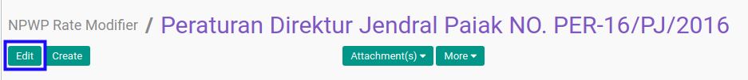

# Memodifikasi NPWP Rate Modifier

## A. INPUT

*(Tidak ada instruksi khusus)*

## B. LANGKAH KERJA

1. Buka menu **Taxform -> Configuration -> PPh 21 -> NPWP Rate Modifier**. Abaikan jika sudah berada pada menu yang dimaksud.
2. Buka data *NPWP Rate Modifier* yang akan dimodifikasi. Abaikan jika data sudah dibuka.
3. Klik tombol **Edit** pada bagian atas-kiri form.

4. Isi dan sesuaikan **[Dasar Hukum](./penjelasan.md#field-dasar-hukum)** jika dibutuhkan. Harus diisi.
5. Pilih dan sesuaikan **[Tanggal Mulai Berlaku](./penjelasan.md#field-date)** jika dibutuhkan. Harus diisi.
6. Isi dan sesuaikan **[PPh Rate Modifier](./penjelasan.md#field-rate)** jika dibutuhkan. Harus diisi.
7. Klik tombol **Save** pada bagian atas-kiri form.

## C. OUTPUT

* Data *NPWP Rate Modifier* akan berubah sesuai dengan perubahan yang dilakukan.
