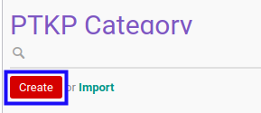

# Membuat PTKP Category

## A. INPUT

*(Tidak ada instruksi khusus)*

## B. LANGKAH KERJA

1. Buka menu **Taxform -> Configuration -> PPh 21 -> PTKP Category**. Abaikan jika sudah berada pada menu yang dimaksud.
2. Klik tombol **Create** pada bagian atas-kiri form.

3. Isi **[Category](./penjelasan.md#field-category)**. Harus diisi.
4. Isi **[Additional Note](./penjelasan.md#field-note)**. Tidak harus diisi.
5. Klik tombol **Save** pada bagian atas-kiri form.

## C. OUTPUT

* Data PTKP Category akan terbuat.
