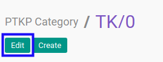
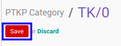

# Memodifikasi PTKP Category

## A. INPUT

*(Tidak ada instruksi khusus)*

## B. LANGKAH KERJA

1. Buka menu **Taxform -> Configuration -> PPh 21 -> PTKP Category**. Abaikan jika sudah berada pada menu yang dimaksud.
2. Buka data *PTKP Category* yang akan dimodifikasi. Abaikan jika data sudah dibuka.
3. Klik tombol **Edit** pada bagian atas-kiri form.

4. Isi dan sesuaikan **[Category](./penjelasan.md#field-category)** jika dibutuhkan. Harus diisi.
5. Isi dan sesuaikan **[Additional Note](./penjelasan.md#field-note)** jika dibutuhkan. Harus diisi.
6. Klik tombol **Save** pada bagian atas-kiri form.

## C. OUTPUT

* Data *PTKP Category* akan berubah sesuai dengan perubahan yang dilakukan.
