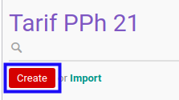

# Membuat Tarif PPh 21

## A. INPUT

*(Tidak ada instruksi khusus)*

## B. LANGKAH KERJA

1. Buka menu **Taxform -> Configuration -> PPh 21 -> Tarif PPh 21**. Abaikan jika sudah berada pada menu yang dimaksud.
2. Klik tombol **Create** pada bagian atas-kiri form.

3. Isi **[Dasar Hukum](./penjelasan.md#field-dasar-hukum)**. Harus diisi.
4. Pilih **[Tanggal Mulai Berlaku](./penjelasan.md#field-date)**. Harus diisi.
5. <a name="l5">[Tambah](./menambahkan-min-income.md)/[Modifikasi](./memodifikasi-min-income.md)/[Hapus](./menghapus-min-income.md) **Min. Income**</a>. Ulangi langkah ini sampai **Min. Income** sesuai dengan keinginan.
6. Klik tombol **Save** pada bagian atas-kiri form.

## C. OUTPUT

* Data Tarif PPh 21 akan terbuat.
