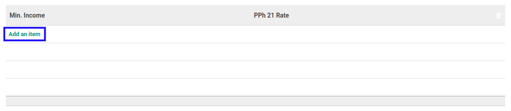

# Menambahkan Minimum Income

*(Instruksi kerja ini merupakan sub instruksi dari (1) [Membuat Tarif PPh 21](./membuat.md), atau (2) [Memodifikasi Tarif PPh 21](./memodifikasi.md). Instruksi kerja ini tidak bisa berdiri sendiri)*

## A. INPUT

*(Tidak ada instruksi khusus)*

## B. LANGKAH KERJA

1. Klik label **Add an Item** pada tabel *Min. Income*.

2. Isi **[Min. Income](./penjelasan.md#field-min-income)**. Harus diisi.
3. Isi **[Tanggal Mulai Berlaku](./penjelasan.md#field-date)**. Tidak harus diisi.
4. Lanjutkan [langkah ke-5 instruksi Membuat Tarif PPh 21](./membuat.md#l5) atau [langkah ke-6 instruksi Memodifikasi Tarif PPh 21](./memodifikasi.md#l6).

## C. OUTPUT

*(Tidak ada instruksi khusus)*
