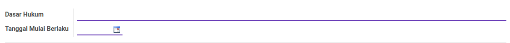
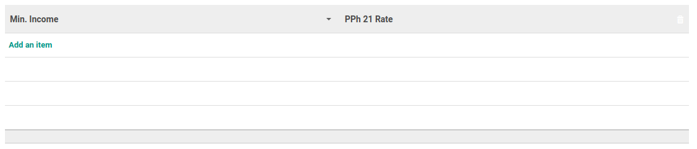

# Penjelasan Tarif PPh 21

Informasi pada *Tarif PPh 21* dibagi menjadi beberapa bagian, yaitu:

  * [Header](#bagian-header)
  * [Tabel Minimum Income](#tabel-min-income)

### <a name="bagian-header">HEADER</a>

#### <a name="field-dasar-hukum">Dasar Hukum</a>

Dasar hukum.

#### <a name="field-date">Tanggal Mulai Berlaku</a>

Tanggal mulai berlaku.

### <a name="tabel-min-income">MIN. INCOME</a>

#### <a name="field-min-income">Min. Income</a>

Minimum Income.

#### <a name="field-pph-21-rate">PPh 21 Rate</a>

PPh 21 Rate.
