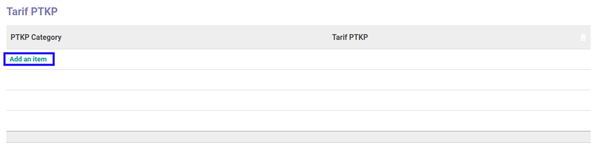
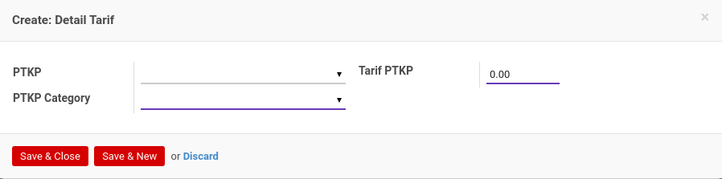
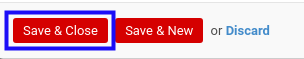

# Menambahkan Tarif Per Kategori PTKP

*(Instruksi kerja ini merupakan sub instruksi dari (1) [Membuat Tarif PTKP](./membuat.md), atau (2) [Memodifikasi Tarif PTKP](./memodifikasi.md). Instruksi kerja ini tidak bisa berdiri sendiri)*

## A. INPUT

*(Tidak ada instruksi khusus)*

## B. LANGKAH KERJA

1. Klik label **Add an Item** pada bagian atas-kiri tabel ***Tarif PTKP***

Pop-up **Detail Tarif** akan muncul.

2. Pilih **[PTKP](./penjelasan.md#field-ptkp)**. Tidak harus diisi.
3. Pilih **[PTKP Category](./penjelasan.md#field-ptkp-category)**. Harus diisi.
4. Isi **[Tarif PTKP](./penjelasan.md#field-tarif-ptkp)**. Harus diisi.
5. Klik tombol **Save & Close** pada bagian bawah-kiri pop-up **Detail Tarif** untuk menyimpan data. Klik tombol **Save & New** pada bagian bawah-kiri pop-up **Detail Tarif** untuk menyimpan data dan menambahkan data baru.

6. Ulangi langkah ke-2 jika pada langkah ke-5 tombol **Save & New** yang dipilih.
7. Lanjutkan [langkah ke-5 instruksi kerja Membuat Tarif PTKP](./membuat.md#l5) atau [langkah ke-6 instruksi kerja Memodifikasi Tarif PTKP](./memodifikasi.md#l6).

## C. OUTPUT

*(Tidak ada instruksi khusus)*
