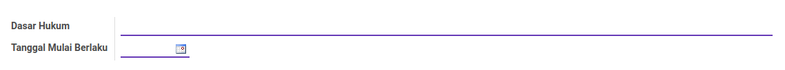
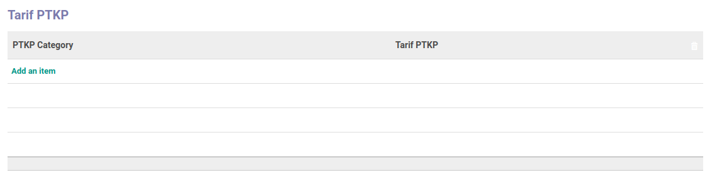

# Penjelasan Tarif PTKP

Informasi pada *Tarif PTKP* dibagi menjadi beberapa bagian, yaitu:

  * [Header](#bagian-header)
  * [Tabel Tarif PTKP](#tabel-tarif-ptkp)

### <a name="bagian-header">HEADER</a>

#### <a name="field-dasar-hukum">Dasar Hukum</a>

Dasar hukum.

#### <a name="field-date">Tanggal Mulai Berlaku</a>

Tanggal mulai berlaku.

### <a name="tabel-tarif-ptkp">TARIF PTKP</a>

*Pop Up Tarif PTKP* saat *add an item* diklik.

#### <a name="field-ptkp">PTKP</a>

PTKP.

#### <a name="field-ptkp-category">PTKP Category</a>

Kategori PTKP.

#### <a name="field-tarif-ptkp">Tarif PTKP</a>

Tarif PTKP.
