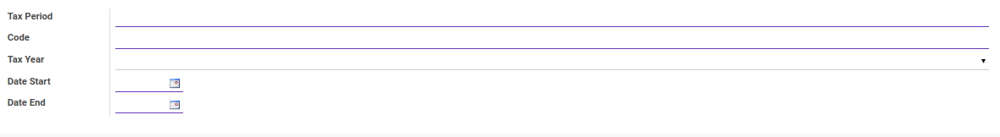

# Penjelasan Tax Period

Informasi pada *Tax Period* dibagi menjadi beberapa bagian, yaitu:

  * [Header](#bagian-header)

### <a name="bagian-header">HEADER</a>

#### <a name="field-tax-period">Tax Period</a>

Periode Pajak.

#### <a name="field-code">Code</a>

Kode yang digunakan untuk Periode Pajak.

#### <a name="field-tax-year">Tax Year</a>

Tahun Pajak.

#### <a name="field-date-start">Date Start</a>

Tanggal Mulai Periode Pajak.

#### <a name="field-date-end">Date End</a>

Tanggal Akhir Periode Pajak.
