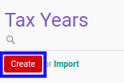

# Membuat Tax Year

## A. INPUT

*(Tidak ada instruksi khusus)*

## B. LANGKAH KERJA

1. Buka menu **Taxform -> Configuration -> Periods -> Tax Years**. Abaikan jika sudah berada pada menu yang dimaksud.
2. Klik tombol **Create** pada bagian atas-kiri form.

3. Isi **[Tax Year](./penjelasan.md#field-tax-year)**. Harus diisi.
4. Isi **[Code](./penjelasan.md#field-code)**. Harus diisi.
5. Pilih **[Date Start](./penjelasan.md#field-date-start)**. Harus diisi.
6. Pilih **[Date End](./penjelasan.md#field-date-end)**. Harus diisi.
7. <a name="l7">[Tambah](./menambahkan-tax-period.md)/[Modifikasi](./memodifikasi-tax-period.md)/[Hapus](./menghapus-tax-period.md) **Tax Period**</a>. Ulangi langkah ini sampai **Tax Period** sesuai dengan keinginan.
8. Klik tombol **Save** pada bagian atas-kiri form.

## C. OUTPUT

* Data *Tax Year* akan terbuat.
