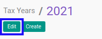
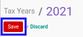

# Memodifikasi Tax Year

## A. INPUT

*(Tidak ada instruksi khusus)*

## B. LANGKAH KERJA

1. Buka menu **Taxform -> Configuration -> Periods -> Tax Years**. Abaikan jika sudah berada pada menu yang dimaksud.
2. Buka data *Tax Year* yang akan dimodifikasi. Abaikan jika data sudah dibuka.
3. Klik tombol **Edit** pada bagian atas-kiri form.

4. Isi dan sesuaikan **[Tax Year](./penjelasan.md#field-tax-year)** jika dibutuhkan. Harus diisi.
5. Isi dan sesuaikan **[Code](./penjelasan.md#field-code)** jika dibutuhkan. Harus diisi.
6. Pilih dan sesuaikan **[Date Start](./penjelasan.md#field-date-start)** jika dibutuhkan. Harus diisi.
7. Pilih dan sesuaikan **[Date End](./penjelasan.md#field-date-end)** jika dibutuhkan. Harus diisi.
8. <a name="l8">[Tambah](./menambahkan-tax-period.md)/[Modifikasi](./memodifikasi-tax-period.md)/[Hapus](./menghapus-tax-period.md) **Tax Period**</a>. Ulangi langkah ini sampai **Tax Period** sesuai dengan keinginan.
9. Klik tombol **Save** pada bagian atas-kiri form.

## C. OUTPUT

* Data *Tax Year* akan berubah sesuai dengan perubahan yang dilakukan.
