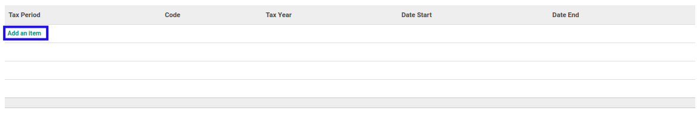
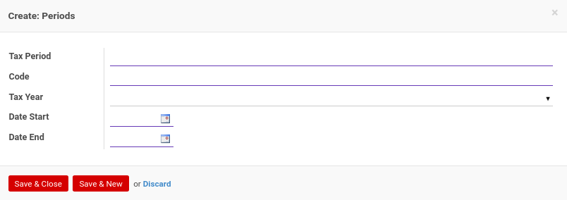

# Menambahkan Tax Period

*(Instruksi kerja ini merupakan sub instruksi dari (1) [Membuat Tax Year](./membuat.md), atau (2) [Memodifikasi Tax Year](./memodifikasi.md). Instruksi kerja ini tidak bisa berdiri sendiri)*

## A. INPUT

*(Tidak ada instruksi khusus)*

## B. LANGKAH KERJA

1. Klik label **Add an Item** pada bagian atas-kiri tabel ***Tax Period***

Pop-up **Periods** akan muncul.

2. Isi **[Tax Period](./penjelasan.md#field-tax-period)**. Harus diisi.
3. Isi **[Code](./penjelasan.md#field-tax-period-code)**. Harus diisi.
4. Pilih **[Tax Year](./penjelasan.md#field-tax-period-tax-year)**. Tidak harus diisi.
5. Pilih **[Date Start](./penjelasan.md#field-tax-period-date-start)**. Harus diisi.
6. Pilih **[Date End](./penjelasan.md#field-tax-period-date-end)**. Harus diisi.
7. Klik tombol **Save & Close** pada bagian bawah-kiri pop-up **Periods** untuk menyimpan data. Klik tombol **Save & New** pada bagian bawah-kiri pop-up **Periods** untuk menyimpan data dan menambahkan data baru.

8. Ulangi langkah ke-2 jika pada langkah ke-7 tombol **Save & New** yang dipilih.
9. Lanjutkan [langkah ke-7 instruksi kerja Membuat Tax Year](./membuat.md#l7) atau [langkah ke-8 instruksi kerja Memodifikasi Tax Year](./memodifikasi.md#l8).

## C. OUTPUT

*(Tidak ada instruksi khusus)*
