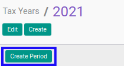

# Membuat Tax Period Secara Masal

Proses ini dilakukan untuk membuat data periode pajak (*Tax Period*) secara masal pada suatu tahun pajak (*Tax Year*).
Proses ini adalah proses **yang sering digunakan** untuk mempermudah dan mempercepat pembuatan periode pajak.

## A. INPUT

*(Data Tax Year sudah diinput)*

## B. LANGKAH KERJA

1. Buka menu **Taxform -> Configuration -> Periods -> Tax Years**. Abaikan jika sudah berada pada menu yang dimaksud.
2. Buka data *Tax Year* yang akan dibuat periode pajak nya. Abaikan jika data sudah dibuka.
3. Klik Tombol **Create Period** di bagian atas-kiri form.

## C. OUTPUT

*Data periode pajak (tax period) pada tahun pajak (tax year) akan tersimpan secara otomatis*
