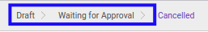
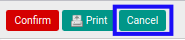
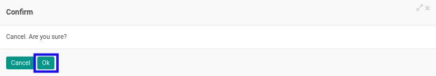
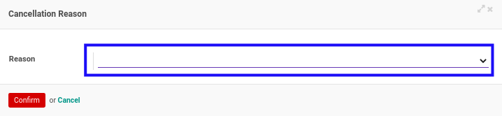
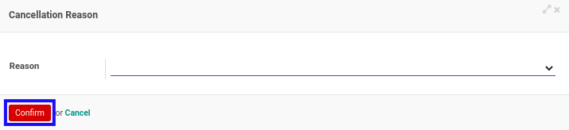
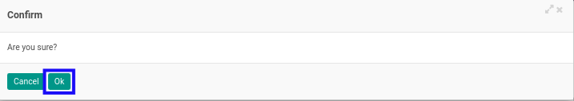

# Membatalkan Form 1721 A1

## A. INPUT

* Data *Form 1721 A1* yang akan dibatalkan harus memiliki status selain **Cancel**.

* User yang akan membatalkan harus memiliki akses untuk membatalkan *Form 1721 A1*.

## B. LANGKAH KERJA

1. Buka menu **Taxform -> Bukti Potong -> Taxform 1721 A1**. Abaikan jika sudah berada pada menu yang dimaksud.
2. Buka data *Form 1721 A1* yang akan dibatalkan. Abaikan jika data sudah dibuka.
3. Klik tombol **Cancel** pada bagian atas-kiri form.

4. Klik tombol **Ok** pada *pop-up* konfirmasi pembatalan yang muncul.

5. Pilih **Reason** pada *pop-up* **Cancellation Reason** yang muncul.

6. Klik tombol **Confirm** pada *pop-up* Cancellation Reason.

7. Klik tombol **Ok** pada *pop-up* konfirmasi pembatalan yang muncul.

## C. OUTPUT

* Status dari *Form 1721 A1* akan berubah menjadi **Cancelled**

