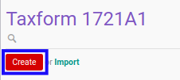

# Membuat Form 1721 A1

## A. INPUT

*(Tidak ada instruksi khusus)*

## B. LANGKAH KERJA

1. Buka menu **Taxform -> Bukti Potong -> Taxform 1721 A1**. Abaikan jika sudah berada pada menu yang dimaksud.
2. Klik tombol **Create** pada bagian atas-kiri form.

3. Ubah **[# Bukti Potong](./penjelasan.md#field-no-1721a1)** dengan penomeran yang dikehendaki. Biarkan berisi **/** apabila menghendaki penomeran otomatis.
4. Pilih **[Wajib Pajak](./penjelasan.md#field-wajib-pajak)**. Wajib diisi.
5. Isi **[NPWP](./penjelasan.md#field-npwp)**. Wajib diisi.
6. Isi **[NIK](./penjelasan.md#field-nik)**. Wajib diisi.
7. Pilih **[PTKP Kategori](./penjelasan.md#field-ptkp-kategori)**. Wajib diisi.
8. Pilih **[Kode Objek Pajak](./penjelasan.md#field-kode-objek-pajak)**. Wajib diisi.
9. Pilih **[Pemotong Pajak](./penjelasan.md#field-pemotong-pajak)**. Wajib diisi.
10. Pilih **[Date](./penjelasan.md#field-date)**. Wajib diisi.
11. Pilih **[Tax Year](./penjelasan.md#field-tax-year)**. Wajib diisi.
12. Pilih **[Period Awal](./penjelasan.md#field-period-awal)**. Wajib diisi.
13. Pilih **[Period Akhir](./penjelasan.md#field-period-akhir)**. Wajib diisi.
14. Pilih **[TTD](./penjelasan.md#field-ttd)**. Wajib diisi.
15. Beralih ke tab **[Informasi Umum](./penjelasan.md#tab-informasi-umum)**.
16. Isi **[Alamat](./penjelasan.md#field-alamat)**. Wajib diisi.
17. Isi **[Alamat2](./penjelasan.md#field-alamat2)**. Tidak wajib diisi.
18. Isi **[Kota](./penjelasan.md#field-kota)**. Tidak wajib diisi.
19. Pilih **[State](./penjelasan.md#field-state)**. Tidak wajib diisi.
20. Pilih **[Negara](./penjelasan.md#field-negara)**. Tidak wajib diisi.
21. Isi **[ZIP](./penjelasan.md#field-zip)**. Tidak wajib diisi.
22. Pilih **[Jenis Kelamin](./penjelasan.md#field-jenis-kelamin)**. Tidak wajib diisi.
23. Isi **[Jabatan](./penjelasan.md#field-jabatan)**. Wajib diisi.
24. Aktifkan/ Deaktifkan **[Karyawan Asing](./penjelasan.md#field-karyawan-asing)**. Tidak wajib diisi.
25. Isi **[Kode Negara Domisili](./penjelasan.md#field-kode-negara-domisili)**. Tidak wajib diisi.
26. Beralih ke tab **[Penghasilan Bruto](./penjelasan.md#tab-penghasilan-bruto)**.
27. Isi **[Gaji/Pensiun Atau THT/JHT](./penjelasan.md#field-gaji-pensiun)**. Tidak wajib diisi.
28. Isi **[Tunjangan PPh](./penjelasan.md#field-tunjangan-pph)**. Tidak wajib diisi.
29. Isi **[Tunjangan Lainnya, Uang Lembur Dan Sebagainya](./penjelasan.md#field-tunjangan-lainnya)**. Tidak wajib diisi.
30. Isi **[Honorarium Dan Imbalan Lain Sejenisnya](./penjelasan.md#field-honorarium)**. Tidak wajib diisi.
31. Isi **[Premi Asuransi Yang Dibayar Pemberi Kerja](./penjelasan.md#field-premi-asuransi)**. Tidak wajib diisi.
32. Isi **[Penerimaan Dalam Bentuk Natura Yang Dikenakan PPh Pasal 21](./penjelasan.md#field-natura)**. Tidak wajib diisi.
33. Isi **[Tantiem, Bonus, Gratifikasi, Jasa Produksi dan THR](./penjelasan.md#field-tantiem)**. Tidak wajib diisi.
34. Beralih ke tab **[Pengurangan](./penjelasan.md#tab-pengurangan)**.
35. Isi **[Iuran Pensiun Atau Iuran THT/JHT](./penjelasan.md#field-iuran-pensiun)**. Tidak wajib diisi.
36. Beralih ke tab **[Penghitungan PPh Pasal 21](./penjelasan.md#tab-penghitungan-pph)**.
37. Isi **[Penghasilan Neto Masa Sebelumnya](./penjelasan.md#field-neto-sebelum)**. Tidak wajib diisi.
38. Isi **[PPh Pasal 21 Yang Telah Dipotong Masa Sebelumnya](./penjelasan.md#field-pph-21-potong)**. Tidak wajib diisi.
39. Isi **[PPh Pasal 21 Dan PPh Pasal 26 Yang Telah Dipotong Dan Dilunasi](./penjelasan.md#field-pph-21-26-lunas)**. Tidak wajib diisi.
40. Klik tombol **Save** pada bagian atas-kiri form.

## C. OUTPUT

* Data *Form 1721 A1* akan terbuat dengan status **Draft**

