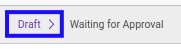

# Memodifikasi Form 1721 A1

## A. INPUT

* Data *Form 1721 A1* yang dapat dimodifikasi harus memiliki status **Draft**.

* User yang akan memodifikasi harus memiliki akses untuk memodifikasi *Form 1721 A1*.

## B. LANGKAH KERJA

1. Buka menu **Taxform -> Bukti Potong -> Taxform 1721 A1**. Abaikan jika sudah berada pada menu yang dimaksud.
2. Buka data *Form 1721 A1* yang akan dimodifikasi. Abaikan jika data sudah dibuka.
3. Klik tombol **Edit** pada bagian atas-kiri form.

4. Ubah **[# Bukti Potong](./penjelasan.md#field-no-1721a1)** jika dibutuhkan. Wajib diisi.
5. Pilih dan sesuaikan **[Wajib Pajak](./penjelasan.md#field-wajib-pajak)** jika dibutuhkan. Wajib diisi.
6. Isi dan sesuaikan **[NPWP](./penjelasan.md#field-npwp)** jika dibutuhkan. Wajib diisi.
7. Isi dan sesuaikan **[NIK](./penjelasan.md#field-nik)** jika dibutuhkan. Wajib diisi.
8. Pilih dan sesuaikan **[PTKP Kategori](./penjelasan.md#field-ptkp-kategori)** jika dibutuhkan. Wajib diisi.
9. Pilih dan sesuaikan **[Kode Objek Pajak](./penjelasan.md#field-kode-objek-pajak)** jika dibutuhkan. Wajib diisi.
10. Pilih dan sesuaikan **[Pemotong Pajak](./penjelasan.md#field-pemotong-pajak)** jika dibutuhkan. Wajib diisi.
11. Pilih dan sesuaikan **[Date](./penjelasan.md#field-date)** jika dibutuhkan. Wajib diisi.
12. Pilih dan sesuaikan **[Tax Year](./penjelasan.md#field-tax-year)** jika dibutuhkan. Wajib diisi.
13. Pilih dan sesuaikan **[Period Awal](./penjelasan.md#field-period-awal)** jika dibutuhkan. Wajib diisi.
14. Pilih dan sesuaikan **[Period Akhir](./penjelasan.md#field-period-akhir)** jika dibutuhkan. Wajib diisi.
15. Pilih dan sesuaikan **[TTD](./penjelasan.md#field-ttd)** jika dibutuhkan. Wajib diisi.
16. Beralih ke tab **[Informasi Umum](./penjelasan.md#tab-informasi-umum)**.
17. Isi dan sesuaikan **[Alamat](./penjelasan.md#field-alamat)** jika dibutuhkan. Wajib diisi.
18. Isi dan sesuaikan **[Alamat2](./penjelasan.md#field-alamat2)** jika dibutuhkan. Tidak wajib diisi.
19. Isi dan sesuaikan **[Kota](./penjelasan.md#field-kota)** jika dibutuhkan. Tidak wajib diisi.
20. Pilih dan sesuaikan **[State](./penjelasan.md#field-state)** jika dibutuhkan. Tidak wajib diisi.
21. Pilih dan sesuaikan **[Negara](./penjelasan.md#field-negara)** jika dibutuhkan. Tidak wajib diisi.
22. Isi dan sesuaikan **[ZIP](./penjelasan.md#field-zip)** jika dibutuhkan. Tidak wajib diisi.
23. Pilih dan sesuaikan **[Jenis Kelamin](./penjelasan.md#field-jenis-kelamin)** jika dibutuhkan. Tidak wajib diisi.
24. Isi dan sesuaikan **[Jabatan](./penjelasan.md#field-jabatan)** jika dibutuhkan. Wajib diisi.
25. Aktifkan/ Deaktifkan **[Karyawan Asing](./penjelasan.md#field-karyawan-asing)** jika dibutuhkan. Tidak wajib diisi.
26. Isi dan sesuaikan **[Kode Negara Domisili](./penjelasan.md#field-kode-negara-domisili)** jika dibutuhkan. Tidak wajib diisi.
27. Beralih ke tab **[Penghasilan Bruto](./penjelasan.md#tab-penghasilan-bruto)**.
28. Isi dan sesuaikan **[Gaji/Pensiun Atau THT/JHT](./penjelasan.md#field-gaji-pensiun)** jika dibutuhkan. Tidak wajib diisi.
29. Isi dan sesuaikan **[Tunjangan PPh](./penjelasan.md#field-tunjangan-pph)** jika dibutuhkan. Tidak wajib diisi.
30. Isi dan sesuaikan **[Tunjangan Lainnya, Uang Lembur Dan Sebagainya](./penjelasan.md#field-tunjangan-lainnya)** jika dibutuhkan. Tidak wajib diisi.
31. Isi dan sesuaikan **[Honorarium Dan Imbalan Lain Sejenisnya](./penjelasan.md#field-honorarium)** jika dibutuhkan. Tidak wajib diisi.
32. Isi dan sesuaikan **[Premi Asuransi Yang Dibayar Pemberi Kerja](./penjelasan.md#field-premi-asuransi)** jika dibutuhkan. Tidak wajib diisi.
33. Isi dan sesuaikan **[Penerimaan Dalam Bentuk Natura Yang Dikenakan PPh Pasal 21](./penjelasan.md#field-natura)** jika dibutuhkan. Tidak wajib diisi.
34. Isi dan sesuaikan **[Tantiem, Bonus, Gratifikasi, Jasa Produksi dan THR](./penjelasan.md#field-tantiem)** jika dibutuhkan. Tidak wajib diisi.
35. Beralih ke tab **[Pengurangan](./penjelasan.md#tab-pengurangan)**.
36. Isi dan sesuaikan **[Iuran Pensiun Atau Iuran THT/JHT](./penjelasan.md#field-iuran-pensiun)** jika dibutuhkan. Tidak wajib diisi.
37. Beralih ke tab **[Penghitungan PPh Pasal 21](./penjelasan.md#tab-penghitungan-pph)**.
38. Isi dan sesuaikan **[Penghasilan Neto Masa Sebelumnya](./penjelasan.md#field-neto-sebelum)** jika dibutuhkan. Tidak wajib diisi.
39. Isi dan sesuaikan **[PPh Pasal 21 Yang Telah Dipotong Masa Sebelumnya](./penjelasan.md#field-pph-21-potong)** jika dibutuhkan. Tidak wajib diisi.
40. Isi dan sesuaikan **[PPh Pasal 21 Dan PPh Pasal 26 Yang Telah Dipotong Dan Dilunasi](./penjelasan.md#field-pph-21-26-lunas)** jika dibutuhkan. Tidak wajib diisi.
41. Klik tombol **Save** pada bagian atas-kiri form.

## C. OUTPUT

* Data *Form 1721 A1* akan berubah sesuai dengan perubahan yang dilakukan.
