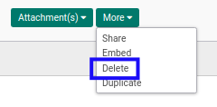
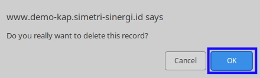

# Menghapus Form 1721 A1

## A. INPUT

* Data *Form 1721 A1* yang dapat dihapus harus memiliki status **Draft**.

* Data *Form 1721 A1* harus memiliki # Bukti Potong sama dengan /
* User yang akan menghapus harus memiliki akses untuk menghapus *Form 1721 A1*.

## B. LANGKAH KERJA

1. Buka menu **Taxform -> Bukti Potong -> Taxform 1721 A1**. Abaikan jika sudah berada pada menu yang dimaksud.
2. Buka data *Form 1721 A1* yang akan dihapus. Abaikan jika data sudah dibuka.
3. Klik tombol **More** pada bagian atas-tengah form.

4. Klik tombol **Delete** pada *dropdown* yang muncul ketika tombol **More** diklik.

5. Klik tombol **Ok** pada *pop-up* konfirmasi penghapusan yang muncul.

## C. OUTPUT

* Data *Form 1721 A1* akan terhapus.
