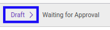
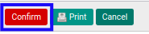
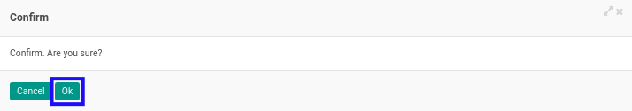

# Mengkonfirmasi Form 1721 A1

* Data *Form 1721 A1* yang dapat dikonfirmasi harus memiliki status **Draft**.

* User yang akan mengkonfirmasi harus memiliki akses untuk mengkonfirmasi *Form 1721 A1*.

## B. LANGKAH KERJA

1. Buka menu **Taxform -> Bukti Potong -> Taxform 1721 A1**. Abaikan jika sudah berada pada menu yang dimaksud.
2. Buka data *Form 1721 A1* yang akan dikonfirmasi. Abaikan jika data sudah dibuka.
3. Klik tombol **Confirm** pada bagian atas-kiri form.

4. Klik tombol **Ok** pada *pop-up* konfirmasi confirm yang muncul.

## C. OUTPUT

* Status dari *Form 1721 A1* akan berubah menjadi **Waiting for Approval**.

* Isian *Form 1721 A1* sudah tidak bisa diubah.
