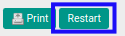
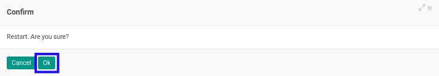

# Merestart Form 1721 A1

## A. INPUT

* Data *Form 1721 A1* yang akan direstart harus memiliki status **Cancel**.

* User yang akan merestart harus memiliki akses untuk merestart *From 1721 A1*.

## B. LANGKAH KERJA

1. Buka menu **Taxform -> Bukti Potong -> Taxform 1721 A1**. Abaikan jika sudah berada pada menu yang dimaksud.
2. Buka data *Form 1721 A1* yang akan direstart. Abaikan jika data sudah dibuka.
3. Klik tombol **Restart** pada bagian atas-kiri form.

4. Klik tombol **Ok** pada *pop-up* konfirmasi restart yang muncul.

## C. OUTPUT

* Status dari *Form 1721 A1* akan berubah menjadi **Draft**.

* *Form 1721 A1* dapat kembali dimodifikasi.
