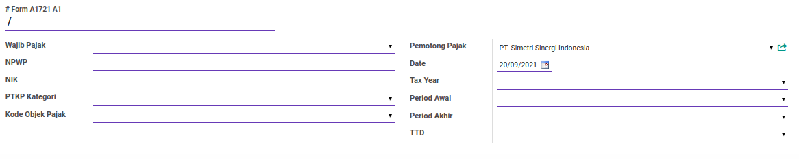
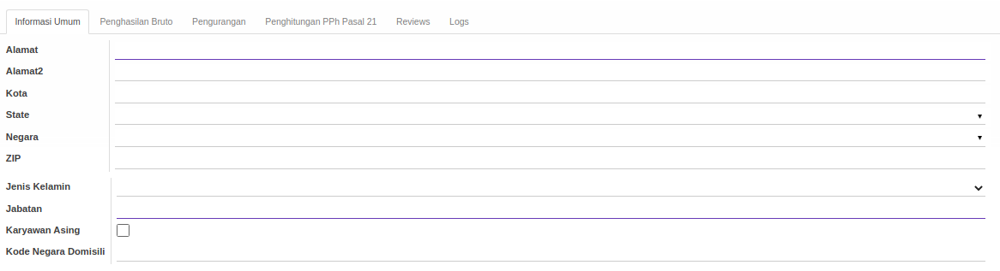
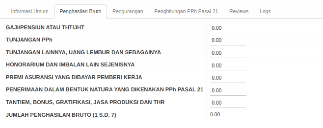
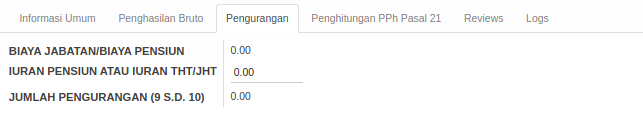
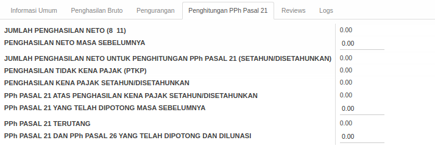
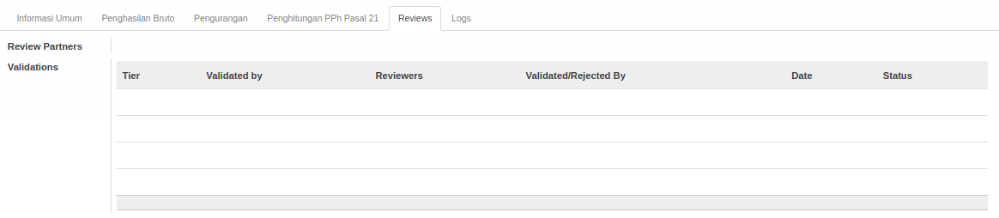
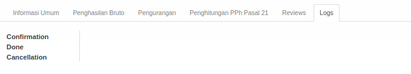

# Penjelasan Form 1721 A1

Informasi pada *Form 1721 A1* dibagi menjadi beberapa bagian, yaitu:

* [Header](#bagian-header)
* [Tab Informasi Umum](#tab-informasi-umum)
* [Tab Penghasilan Bruto](#tab-penghasilan-bruto)
* [Tab Pengurangan](#tab-pengurangan)
* [Tab Penghitungan PPh Pasal 21](#tab-penghitungan-pph)
* [Tab Reviews](#tab-reviews)
* [Tab Logs](#tab-logs)

### <a name="bagian-header">HEADER</a>

#### <a name="field-no-1721a1"># Form A11721 A1</a>

Nomor form 1721 A1.

#### <a name="field-wajib-pajak">Wajib Pajak</a>

Nama wajib pajak.

#### <a name="field-npwp">NPWP</a>

Nomor NPWP wajib pajak.

#### <a name="field-nik">NIK</a>

Nomor NIK wajib pajak.

#### <a name="field-ptkp-kategori">PTKP Kategori</a>

Kategori PTKP wajib pajak.

#### <a name="field-kode-objek-pajak">Kode Objek Pajak</a>

Kode Objek Pajak.

#### <a name="field-pemotong-pajak">Pemotong Pajak</a>

Nama pemotong pajak.

#### <a name="field-date">Date</a>

Tanggal.

#### <a name="field-tax-year">Tax Year</a>

Tahun Pajak.

#### <a name="field-period-awal">Period Awal</a>

Periode Awal.

#### <a name="field-period-akhir">Period Akhir</a>

Periode Akhir.

#### <a name="field-ttd">TTD</a>

Nama penandatangan Form 1721 A1.

#### <a name="tab-informasi-umum">TAB INFORMASI UMUM</a>

#### <a name="field-alamat">Alamat</a>

Alamat.

#### <a name="field-alamat2">Alamat2</a>

Alamat (tambahan).

#### <a name="field-kota">Kota</a>

Nama Kota.

#### <a name="field-state">State</a>

Nama Provinsi.

#### <a name="field-negara">Negara</a>

Nama Negara.

#### <a name="field-zip">ZIP</a>

Nomor Kode Pos.

#### <a name="field-jenis-kelamin">Jenis Kelamin</a>

Jenis Kelamin.

#### <a name="field-jabatan">Jabatan</a>

Jabatan.

#### <a name="field-karyawan-asing">Karyawan Asing</a>

Jika dicentang, wajib pajak adalah karyawan asing.

#### <a name="field-kode-negara-domisili">Kode Negara Domisili</a>

Kode Negara Domisili Karyawan Asing.

#### <a name="tab-penghasilan-bruto">TAB PENGHASILAN BRUTO</a>

#### <a name="field-gaji-pensiun">Gaji/Pensiun Atau THT/JHT</a>

Gaji/Pensiun Atau THT/JHT.

#### <a name="field-tunjangan-pph">Tunjangan PPh</a>

Tunjangan PPh.

#### <a name="field-tunjangan-lainnya">Tunjangan Lainnya, Uang Lembur Dan Sebagainya</a>

Tunjangan Lainnya, Uang Lembur Dan Sebagainya.

#### <a name="field-honorarium">Honorarium Dan Imbalan Lain Sejenisnya</a>

Honorarium dan Imbalan Lain Sejenisnya.

#### <a name="field-premi-asuransi">Premi Asuransi Yang Dibayar Pemberi Kerja</a>

Premi Asuransi Yang Dibayar Pemberi Kerja.

#### <a name="field-natura">Penerimaan Dalam Bentuk Natura Yang Dikenakan PPh Pasal 21</a>

Penerimaan Dalam Bentuk Natura Yang Dikenakan PPh Pasal 21.

#### <a name="field-tantiem">Tantiem, Bonus, Gratifikasi, Jasa Produksi dan THR</a>

Tantiem, Bonus, Gratifikasi, Jasa Produksi dan THR.

#### <a name="field-jumlah-penghasilan-bruto">Jumlah Penghasilan Bruto (1 s.d. 7)</a>

Jumlah Penghasilan Bruto (1 s.d. 7).

#### <a name="tab-pengurangan">TAB PENGURANGAN</a>

#### <a name="field-biaya-jabatan">Biaya Jabatan/Biaya Pensiun</a>

Biaya Jabatan/Biaya Pensiun.

#### <a name="field-iuran-pensiun">Iuran Pensiun Atau Iuran THT/JHT</a>

Iuran Pensiun Atau Iuran THT/JHT.

#### <a name="field-jumlah-pengurangan">Jumlah Pengurangan (9 s.d. 10)</a>

Jumlah Pengurangan (9 s.d. 10).

#### <a name="tab-penghitungan-pph">TAB PENGHITUNGAN PPh PASAL 21</a>

#### <a name="field-jumlah-neto">Jumlah Penghasilan Neto (8 11)</a>

Jumlah Penghasilan Neto (8 11).

#### <a name="field-neto-sebelum">Penghasilan Neto Masa Sebelumnya</a>

Penghasilan Neto Masa Sebelumnya.

#### <a name="field-jumlah-neto-hitung">Jumlah Penghasilan Neto Untuk Penghitungan PPh Pasal 21 (Setahun/Disetahunkan)</a>

Jumlah Penghasilan Neto Untuk Penghitungan PPh Pasal 21 (Setahun/Disetahunkan).

#### <a name="field-ptkp">Penghasilan Tidak Kena Pajak</a>

Penghasilan Tidak Kena Pajak.

#### <a name="field-pkp">Penghasilan Kena Pajak Setahun/Disetahunkan</a>

Penghasilan Kena Pajak Setahun/Disetahunkan.

#### <a name="field-pph-21">PPh Pasal 21 Atas Penghasilan Kena Pajak Setahun/Disetahunkan</a>

PPh Pasal 21 Atas Penghasilan Kena Pajak Setahun/Disetahunkan.

#### <a name="field-pph-21-potong">PPh Pasal 21 Yang Telah Dipotong Masa Sebelumnya</a>

PPh Pasal 21 Yang Telah Dipotong Masa Sebelumnya.

#### <a name="field-pph-21-terutang">PPh Pasal 21 Terutang</a>

PPh Pasal 21 Terutang.

#### <a name="field-pph-21-26-lunas">PPh Pasal 21 Dan PPh Pasal 26 Yang Telah Dipotong Dan Dilunasi</a>

PPh Pasal 21 Dan PPh Pasal 26 Yang Telah Dipotong Dan Dilunasi.

#### <a name="tab-reviews">TAB REVIEWS</a>

#### <a name="field-review-partners-validations">Review Partners Validations</a>

Nama-nama user yang dapat menyetujui/menolak *Form 1721 A1*

#### <a name="tabel-validations">TABEL Validations</a>

Tahapan-tahapan persetujuan *Form 1721 A1*

#### <a name="field-validations-tier">Tier</a>

Urutan persetujuan

#### <a name="field-validations-validated-by">Validated By</a>

Metode pemilihan user-user yang dapat menyetujui/menolak *Form 1721 A1*. Metode pemilihan terdiri dari 3 (tiga) yaitu:

1. *Specific user*. User-user yang dapat menyetujui/menolak *Form 1721 A1* ditentukan langsung.
2. *Any user in specific group*. User-user yang dapat menyetujui/menolak *Form 1721 A1* adalah user-user yang tergabung dalam kelompok-kelompok user yang ditentukan.
3. *Both specific user and group*. User-user yang dapat menyetujui/menolak *Form 1721 A1* ditentukan langsung ditambah dengan user-user yang tergabung dalam kelompok-kelompok user yang ditentukan.
4. *Python code*. User-user yang dapat menyetujui/menolah *Form 1721 A1* ditentukan oleh algoritma kode python tertentu

#### <a name="field-validations-reviewers">Reviewers</a>

Nama-nama user yang dapat menyetujui/menolak *Form 1721 A1* pada *tier* yang dimaksud.

#### <a name="field-validations-validated-rejected">Validated/Rejected By</a>

User yang menyetujui/menolak *Form 1721 A1*.

#### <a name="field-validations-date">Date</a>

Tanggal dan waktu **Validated/Rejected By** menyetujui/menolak *Form 1721 A1*

#### <a name="field-validations-date">Status</a>

Status persetujuan, terdiri dari 2 (dua) kemungkinan:

1. **Approved**. Tier disetujui.
2. **Rejected**. Tier ditolak.

#### <a name="tab-logs">TAB LOGS</a>

#### <a name="field-confirmation">Confirmation</a>

Waktu konfirmasi dan user yang mengkonfirmasi *Form 1721 A1*.

#### <a name="field-done">Done</a>

Waktu selesai dan user yang menyelesaikan *Form 1721 A1*.

#### <a name="field-cancellation">Cancellation</a>

Waktu batal dan user yang membatalkan *Form 1721 A1*.
