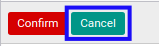
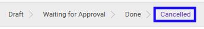

# Membatalkan Bukti Potong PPh 21 Final

## A. INPUT

* Data *Bukti Potong PPh 21 Final* yang akan dibatalkan harus memiliki status selain **Cancel**.

* User yang akan membatalkan harus memiliki akses untuk membatalkan *Bukti Potong PPh 21 Final*.

## B. LANGKAH KERJA

1. Buka menu **Taxform -> Bukti Potong -> Bukti Potong PPh 21 Final (f.1.33.02) Out**. Abaikan jika sudah berada pada menu yang dimaksud.
2. Buka data *Bukti Potong PPh 21 Final* yang akan dibatalkan. Abaikan jika data sudah dibuka.
3. Klik tombol **Cancel** pada bagian atas-kiri form.

4. Klik tombol **Ok** pada *pop-up* konfirmasi pembatalan yang muncul.

## C. OUTPUT

* Status dari *Bukti Potong PPh 21 Final* akan berubah menjadi **Cancelled**

