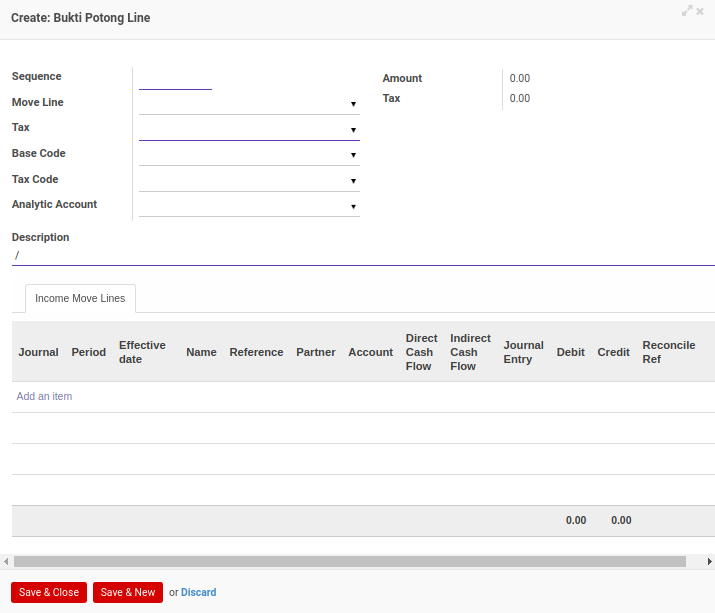

# Menambahkan Detail Bukti Potong

*(Instruksi kerja ini merupakan sub instruksi dari (1) [Membuat Bukti Potong PPh 21 Final](./membuat.md), atau (2) [Memodifikasi Bukti Potong PPh 21 Final](./memodifikasi.md). Instruksi kerja ini tidak bisa berdiri sendiri)*

## A. INPUT

*(Tidak ada instruksi khusus)*

## B. LANGKAH KERJA

1. Klik label **Add an Item** pada bagian atas-kiri tabel ***Detail Bukti Potong***

Pop-up ***Bukti Potong Line*** akan muncul.

2. Isi **[Sequence](./penjelasan.md#field-detail-sequence)**. Wajib diisi.
3. Pilih **[Move Line](./penjelasan.md#field-detail-move-line)**. Tidak wajib diisi.
4. Pilih **[Tax](./penjelasan.md#field-detail-tax)**. Wajib diisi.
5. Pilih **[Base Code](./penjelasan.md#field-detail-base-code)**. Tidak wajib diisi.
6. Pilih **[Tax Code](./penjelasan.md#field-detail-tax-code)**. Tidak wajib diisi.
7. Pilih **[Analytic Account](./penjelasan.md#field-detail-analytic-account)**. Tidak wajib diisi.
8. Isi **[Description](./penjelasan.md#field-detail-description)**. Wajib diisi.
9. Beralih ke tab **[Income Move Line](./penjelasan.md#tab-income-move-line)**.
10. <a name="l10">[Tambah](./menambahkan-income-move-line.md)/[Hapus](./menghapus-income-move-line.md) **Income Move Line**</a>. Ulangi langkah ini sampai **Income Move Line** sesuai dengan keinginan.
11. Klik tombol **Save & Close** pada bagian bawah-kiri pop-up **Bukti Potong Line** untuk menyimpan data. Klik tombol **Save & New** pada bagian bawah-kiri pop-up **Bukti Potong Line** untuk menyimpan data dan menambahkan data baru.

12. Ulangi langkah ke-2 jika pada langkah ke-11 tombol **Save & New** yang dipilih.
13. Lanjutkan [langkah ke-13 instruksi kerja Membuat Bukti Potong PPh 21 Final](./membuat.md#l13) atau [langkah ke-14 instruksi kerja Memodifikasi Bukti Potong PPh 21 Final](./memodifikasi.md#l14).

## C. OUTPUT

*(Tidak ada instruksi khusus)*
