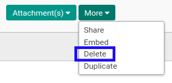

# Menghapus Bukti Potong PPh 21 Tidak Final

## A. INPUT

* Data *Bukti Potong PPh 21 Tidak Final* yang dapat dihapus harus memiliki status **Draft**.

* User yang akan menghapus harus memiliki akses untuk menghapus *Bukti Potong PPh 21 Tidak Final*.

## B. LANGKAH KERJA

1. Buka menu **Taxform -> Bukti Potong -> Bukti Potong PPh 21 Tidak Final (f.1.33.01) Out**. Abaikan jika sudah berada pada menu yang dimaksud.
2. Buka data *Bukti Potong PPh 21 Tidak Final* yang akan dihapus. Abaikan jika data sudah dibuka.
3. Klik tombol **More** pada bagian atas-tengah form.

4. Klik tombol **Delete** pada *dropdown* yang muncul ketika tombol **More** diklik.

5. Klik tombol **Ok** pada *pop-up* konfirmasi penghapusan yang muncul.

## C. OUTPUT

* Data *Bukti Potong PPh 21 Tidak Final* akan terhapus.
