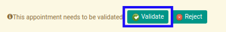

# Menyetujui Bukti Potong PPh 21 Tidak Final

## A. INPUT

* Data *Bukti Potong PPh 21 Tidak Final* yang akan disetujui harus memiliki status **Waiting for Approval**.

* User yang akan menyetujui harus memiliki akses untuk menyetujui *Bukti Potong PPh 21 Tidak Final*.

## B. LANGKAH KERJA

1. Buka menu **Taxform -> Bukti Potong -> Bukti Potong PPh 21 Tidak Final (f.1.33.01) Out**. Abaikan jika sudah berada pada menu yang dimaksud.
2. Buka data *Bukti Potong PPh 21 Tidak Final* yang akan disetujui. Abaikan jika data sudah dibuka.
3. Klik tombol **Validate** pada bagian atas-kiri form.

## C. OUTPUT

* Status dari *Bukti Potong PPh 21 Tidak Final* akan berubah menjadi **Done**.

