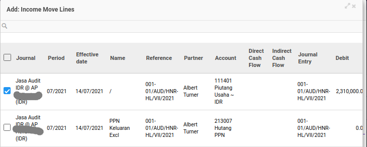

# Menambahkan Income Move Line

*(Instruksi kerja ini merupakan sub instruksi dari (1) [Menambahkan Detail Bukti Potong](./menambahkan-detail-bukti-potong.md), atau (2) [Memodifikasi Detail Bukti Potong](./memodifikasi-detail-bukti-potong.md). Instruksi kerja ini tidak bisa berdiri sendiri)*

## A. INPUT

*(Tidak ada instruksi khusus)*

## B. LANGKAH KERJA

1. Klik label **Add an Item** pada bagian atas-kiri tabel ***Income Move Lines***

Pop-up ***Income Move Lines*** akan muncul.

2. Seleksi data income move line.
3. Klik tombol **Select** pada bagian bawah-kiri pop-up ***Income Move Lines***

4. Lanjutkan [langkah ke-10 instruksi kerja Menambahkan Detail Bukti Potong](./menambahkan-detail-bukti-potong.md#l10) atau [langkah ke-10 instruksi kerja Memodifikasi Detail Bukti Potong](./memodifikasi-detail-bukti-potong.md#l10).

## C. OUTPUT

*(Tidak ada instruksi khusus)*
