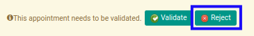

# Menolak Bukti Potong PPh 23 Keluar

## A. INPUT

* Data *Bukti Potong PPh 23 Keluar* yang akan ditolak harus memiliki status **Waiting for Approval**.

* User yang akan menolak harus memiliki akses untuk menolak *Bukti Potong PPh 23 Keluar*.

## B. LANGKAH KERJA

1. Buka menu **Taxform -> Bukti Potong -> Bukti Potong PPh 23 (f.1.33.06) Out**. Abaikan jika sudah berada pada menu yang dimaksud.
2. Buka data *Bukti Potong PPh 23 Keluar* yang akan ditolak. Abaikan jika data sudah dibuka.
3. Klik tombol **Reject** pada bagian atas-kiri form.

## C. OUTPUT

* Data *Bukti Potong PPh 23 Keluar* telah ditolak.
