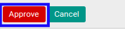
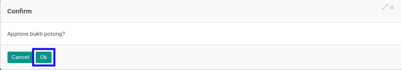

# Menyetujui Bukti Potong PPh 23 Keluar

## A. INPUT

* Data *Bukti Potong PPh 23 Keluar* yang akan disetujui harus memiliki status **Waiting for Approval**.

* User yang akan menyetujui harus memiliki akses untuk menyetujui *Bukti Potong PPh 23 Keluar*.

## B. LANGKAH KERJA

1. Buka menu **Taxform -> Bukti Potong -> Bukti Potong PPh 23 (f.1.33.06) Out**. Abaikan jika sudah berada pada menu yang dimaksud.
2. Buka data *Bukti Potong PPh 23 Keluar* yang akan disetujui. Abaikan jika data sudah dibuka.
3. Klik tombol **Approve** pada bagian atas-kiri form.

4. Klik tombol **Ok** pada *pop-up* konfirmasi persetujuan yang muncul.

## C. OUTPUT

* Status dari *Bukti Potong PPh 23 Keluar* akan berubah menjadi **Done**.

