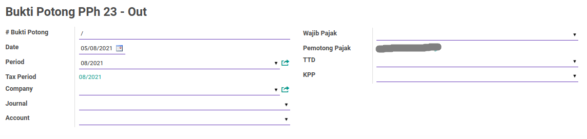
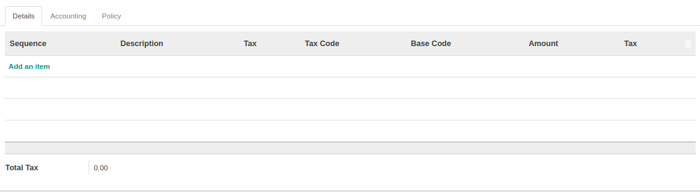
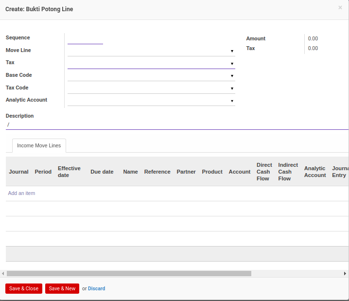
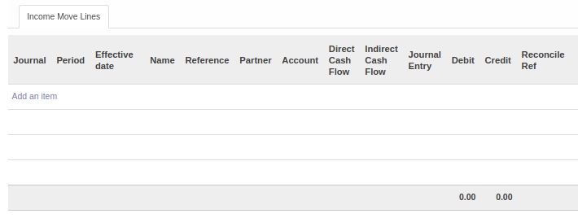
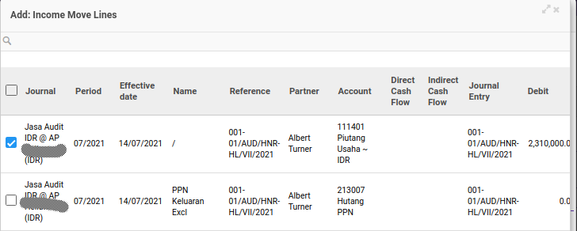
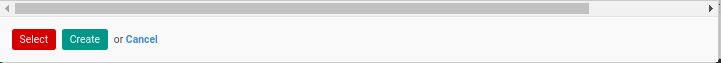
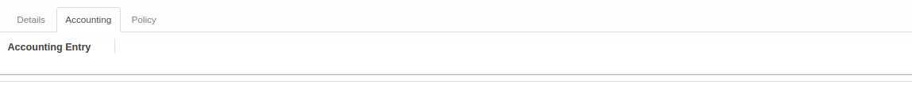
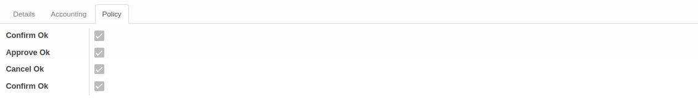

# Pejelasan Bukti Potong PPh 23 Keluar

Informasi pada *Bukti Potong PPh 23 Keluar* dibagi menjadi beberapa bagian, yaitu:

* [Header](#bagian-header)
* [Tab Details](#tab-detail)
* [Tab Accounting](#tab-accounting)
* [Tab Policy](#tab-policy)

### <a name="bagian-header">HEADER</a>

#### <a name="field-no-bukti-potong"># Bukti Potong</a>

Nomor bukti potong.

#### <a name="field-date">Date</a>

Tanggal.

#### <a name="field-period">Period</a>

Periode.

#### <a name="field-tax-period">Tax Period</a>

Periode pajak.

#### <a name="field-company">Company</a>

Nama perusahaan.

#### <a name="field-journal">Journal</a>

Jurnal.

#### <a name="field-account">Account</a>

Akun.

#### <a name="field-wajib-pajak">Wajib Pajak</a>

Nama wajib pajak.

#### <a name="field-pemotong-pajak">Pemotong Pajak</a>

Nama pemotong pajak.

#### <a name="field-ttd">TTD</a>

Nama penandatangan bukti potong.

#### <a name="field-kpp">KPP</a>

Nama Kantor Pelayanan Pajak.

#### <a name="tab-detail">TAB DETAILS</a>

#### <a name="field-detail-table">TABEL Detail Bukti Potong</a>

Tabel detail bukti potong pajak.

*Pop Up Bukti Potong Line* saat *add an item* diklik.

#### <a name="field-detail-sequence">Sequence</a>

Nomor urut.

#### <a name="field-detail-move-line">Move Line</a>

to do.

#### <a name="field-detail-tax">Tax</a>

Jenis pajak.

#### <a name="field-detail-base-code">Base Code</a>

to do.

#### <a name="field-detail-tax-code">Tax Code</a>

to do.

#### <a name="field-detail-analytic-account">Analytic Account</a>

Akun analitik yang digunakan.

#### <a name="field-detail-description">Description</a>

Deskripsi.

#### <a name="field-detail-amount">Amount</a>

Jumlah.

#### <a name="field-detail-tax">Tax</a>

Nilai pajak.

#### <a name="tab-income-move-line">TAB INCOME MOVE LINES</a>

#### <a name="field-detail-table-move-line">TABEL Income Move Line</a>

to do.

*Pop Up Income Move Line* saat *add an item* diklik.

#### <a name="field-move-line-journal">Journal</a>

Jurnal.

#### <a name="field-move-line-period">Period</a>

Periode.

#### <a name="field-move-line-effective-date">Effective Date</a>

Tanggal efektif.

#### <a name="field-move-line-name">Name</a>

Nama.

#### <a name="field-move-line-reference">Reference</a>

Referensi.

#### <a name="field-move-line-partner">Partner</a>

Nama partner.

#### <a name="field-move-line-account">Account</a>

Nama akun.

#### <a name="field-move-line-direct">Direct Cash Flow</a>

Direct cash flow.

#### <a name="field-move-line-indirect">Indirect Cash Flow</a>

Indirect cash flow.

#### <a name="field-move-line-journal-entry">Journal Entry</a>

Entri Jurnal.

#### <a name="field-move-line-debit">Debit</a>

Jumlah Debit.

#### <a name="field-move-line-credit">Credit</a>

Jumlah Kredit.

#### <a name="field-move-line-reconcile">Reconcile Ref</a>

Referensi rekonsiliasi.

#### <a name="tab-accounting">TAB ACCOUNTING</a>

#### <a name="field-accounting-entry">Accounting Entry</a>

to do.

#### <a name="tab-policy">TAB POLICY</a>

#### <a name="field-confirm-ok">Confirm Ok</a>

Berhak/tidaknya user aktif untuk dapat mengkonfirmasi bukti potong PPh 23 keluar.

#### <a name="field-approve-ok">Approve Ok</a>

Berhak/tidaknya user aktif untuk dapat menyetujui bukti potong PPh 23 keluar.

#### <a name="field-cancel-ok">Cancel Ok</a>

Berhak/tidaknya user aktif untuk dapat membatalkan bukti potong PPh 23 keluar.
