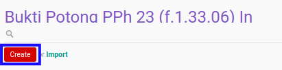

# Membuat Bukti Potong PPh 23 Masuk

## A. INPUT

*(Tidak ada instruksi khusus)*

## B. LANGKAH KERJA

1. Buka menu **Taxform -> Bukti Potong -> Bukti Potong PPh 23 (f.1.33.06) In**. Abaikan jika sudah berada pada menu yang dimaksud.
2. Klik tombol **Create** pada bagian atas-kiri form.

3. Ubah **[# Bukti Potong](./penjelasan.md#field-no-bukti-potong)** dengan penomeran yang dikehendaki. Biarkan berisi **/** apabila menghendaki penomeran otomatis.
4. Pilih **[Date](./penjelasan.md#field-date)**. Wajib diisi.
5. Pilih **[Period](./penjelasan.md#field-period)**. Wajib diisi.
6. Pilih **[Company](./penjelasan.md#field-company)**. Wajib diisi.
7. Pilih **[Journal](./penjelasan.md#field-journal)**. Wajib diisi.
8. Pilih **[Account](./penjelasan.md#field-account)**. Wajib diisi.
9. Pilih **[Pemotong Pajak](./penjelasan.md#field-pemotong-pajak)**. Wajib diisi.
10. Pilih **[TTD](./penjelasan.md#field-ttd)**. Tidak wajib diisi.
11. Pilih **[KPP](./penjelasan.md#field-kpp)**. Wajib diisi.
12. Beralih ke tab **[Detail](./penjelasan.md#tab-detail)**.
13. <a name="l13">[Tambah](./menambahkan-detail-bukti-potong.md)/[Modifikasi](./memodifikasi-detail-bukti-potong.md)/[Hapus](./menghapus-detail-bukti-potong.md) **Detail Bukti Potong**</a>. Ulangi langkah ini sampai **Detail Bukti Potong** sesuai dengan keinginan.
14. Klik tombol **Save** pada bagian atas-kiri form.

## C. OUTPUT

* Data *bukti potong PPh 23 masuk* akan terbuat dengan status **Draft**

