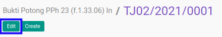
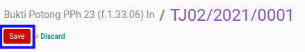

# Memodifikasi Bukti Potong PPh 23 Masuk

## A. INPUT

* Data *Bukti Potong PPh 23 Masuk* yang dapat dimodifikasi harus memiliki status **Draft**.

* User yang akan memodifikasi harus memiliki akses untuk memodifikasi *Bukti Potong PPh 23 Masuk*.

## B. LANGKAH KERJA

1. Buka menu **Taxform -> Bukti Potong -> Bukti Potong PPh 23 (f.1.33.06) In**. Abaikan jika sudah berada pada menu yang dimaksud.
2. Buka data *Bukti Potong PPh 23 Masuk* yang akan dimodifikasi. Abaikan jika data sudah dibuka.
3. Klik tombol **Edit** pada bagian atas-kiri form.

4. Ubah **[# Bukti Potong](./penjelasan.md#field-no-bukti-potong)** jika dibutuhkan. Wajib diisi.
5. Pilih dan sesuaikan **[Date](./penjelasan.md#field-date)** jika dibutuhkan. Wajib diisi.
6. Pilih dan sesuaikan **[Period](./penjelasan.md#field-period)** jika dibutuhkan. Wajib diisi.
7. Pilih dan sesuaikan **[Company](./penjelasan.md#field-company)** jika dibutuhkan. Wajib diisi.
8. Pilih dan sesuaikan **[Journal](./penjelasan.md#field-journal)** jika dibutuhkan. Wajib diisi.
9. Pilih dan sesuaikan **[Account](./penjelasan.md#field-account)** jika dibutuhkan. Wajib diisi.
10. Pilih dan sesuaikan **[Pemotong Pajak](./penjelasan.md#field-pemotong-pajak)** jika dibutuhkan. Wajib diisi.
11. Pilih dan sesuaikan **[TTD](./penjelasan.md#field-ttd)** jika dibutuhkan. Tidak wajib diisi.
12. Pilih dan sesuaikan **[KPP](./penjelasan.md#field-kpp)** jika dibutuhkan. Wajib diisi.
13. Beralih ke tab **[Detail](./penjelasan.md#tab-detail)**.
14. <a name="l14">[Tambah](./menambahkan-detail-bukti-potong.md)/[Modifikasi](./memodifikasi-detail-bukti-potong.md)/[Hapus](./menghapus-detail-bukti-potong.md) **Detail Bukti Potong**</a>. Ulangi langkah ini sampai **Detail Bukti Potong** sesuai dengan keinginan.
15. Klik tombol **Save** pada bagian atas-kiri form.

## C. OUTPUT

* Data *Bukti Potong PPh 23 Masuk* akan berubah sesuai dengan perubahan yang dilakukan.
