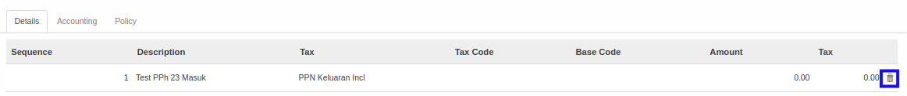

# Menghapus Detail Bukti Potong

*(Instruksi kerja ini merupakan sub instruksi dari (1) [Membuat Bukti Potong PPh 23 Masuk](./membuat.md), atau (2) [Memodifikasi Bukti Potong PPh 23 Masuk](./memodifikasi.md). Instruksi kerja ini tidak bisa berdiri sendiri)*

## A. INPUT

*(Tidak ada instruksi khusus)*

## B. LANGKAH KERJA

1. Klik icon tempat sampah pada bagian kanan data **Detail Bukti Potong** yang akan dihapus.

2. Lanjutkan [langkah ke-13 instruksi kerja Membuat Bukti Potong PPh 23 Masuk](./membuat.md#l13) atau [langkah ke-14 instruksi kerja Memodifikasi Bukti Potong PPh 23 Masuk](./memodifikasi.md#l14).

## C. OUTPUT

*(Tidak ada instruksi khusus)*
