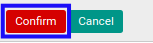
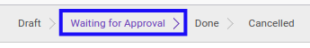

# Mengkonfirmasi Bukti Potong PPh 23 Masuk

## A. INPUT

* Data *Bukti Potong PPh 23 Masuk* yang dapat dikonfirmasi harus memiliki status **Draft**.

* User yang akan mengkonfirmasi harus memiliki akses untuk mengkonfirmasi *Bukti Potong PPh 23 Masuk*.

## B. LANGKAH KERJA

1. Buka menu **Taxform -> Bukti Potong -> Bukti Potong PPh 23 (f.1.33.06) In**. Abaikan jika sudah berada pada menu yang dimaksud.
2. Buka data *Bukti Potong PPh 23 Masuk* yang akan dikonfirmasi. Abaikan jika data sudah dibuka.
3. Klik tombol **Confirm** pada bagian atas-kiri form.

4. Klik tombol **Ok** pada *pop-up* konfirmasi confirm yang muncul.

## C. OUTPUT

* Status dari *Bukti Potong PPh 23 Masuk* akan berubah menjadi **Waiting for Approval**.

* Isian *Bukti Potong PPh 23 Masuk* sudah tidak bisa diubah.
