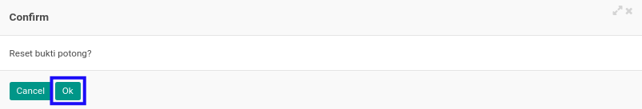

# Merestart Bukti Potong PPh 23 Masuk

## A. INPUT

* Data *Bukti Potong PPh 23 Masuk* yang akan direstart harus memiliki status **Cancel**.

* User yang akan merestart harus memiliki akses untuk merestart *Bukti Potong PPh 23 Masuk*.

## B. LANGKAH KERJA

1. Buka menu **Taxform -> Bukti Potong -> Bukti Potong PPh 23 (f.1.33.06) In**. Abaikan jika sudah berada pada menu yang dimaksud.
2. Buka data *Bukti Potong PPh 23 Masuk* yang akan direstart. Abaikan jika data sudah dibuka.
3. Klik tombol **Set to Draft** pada bagian atas-kiri form.

4. Klik tombol **Ok** pada *pop-up* konfirmasi restart yang muncul.

## C. OUTPUT

* Status dari *Bukti Potong PPh 23 Masuk* akan berubah menjadi **Draft**.

* *Bukti Potong PPh 23 Masuk* dapat kembali dimodifikasi.
